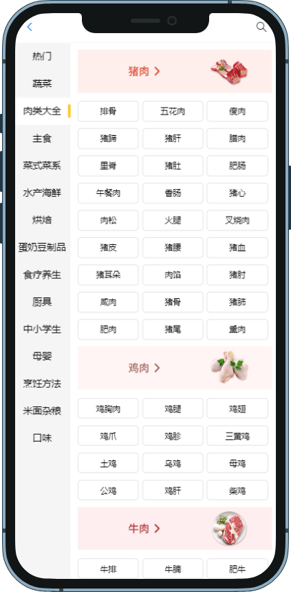
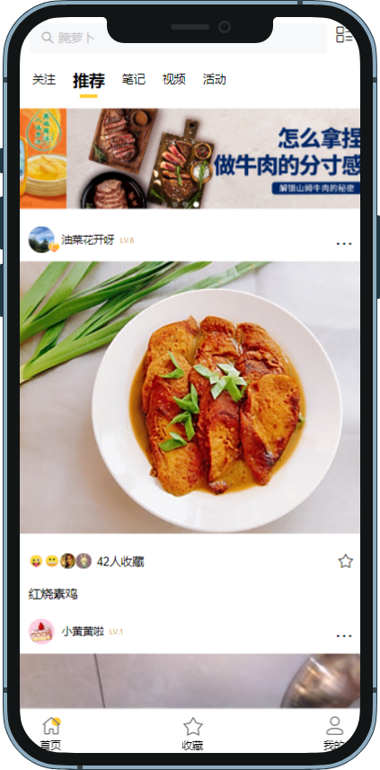

# cookbook-app
该项目是基于Vue2、Vuex、Axios开发的一款菜谱查询APP，整体使用了Sass、Vant2和Echarts来完成页面渲染，通过Vue-router实现登录验证，让用户可以通过推荐页面、菜谱列表以及自主查询获取相关菜谱详情，同时也可以收藏喜欢的菜谱方便下次寻找。

项目功能:
1. 查看每日推荐: 进入首页可以查看每日的相关菜谱推荐，也可以切换至笔记和活动页面，浏览正在举行的活动以及他人笔记推荐
2. 查看食材列表: 点击进入食材列表，通过分类来选择感兴趣的食材，点击后自动跳转到相关菜谱页面
3. 搜索菜谱: 可以通过输入关键词来搜索相关菜谱
4. 查看菜谱详情: 点击任意菜谱都可以访问该菜谱详情，学习做法
5. 登录注册: 通过手机号注册并登录，登录后可以查看收藏的菜谱
6. 收藏菜谱: 登录后，看到心仪的菜谱可以点击右下角的收藏按钮进行收藏

## 部分UI展示

